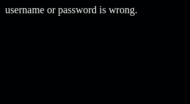

# RDS-check
username and password are in database?

Checks whether the entered username and password are in the aws RDS database.
(you should edit login_check.php)

First of all, there is such a user in the database.

if i enter the correct information

i see this

but if i enter wrong information

i see this error

Caution Take care to make the correct configuration in AWS.
